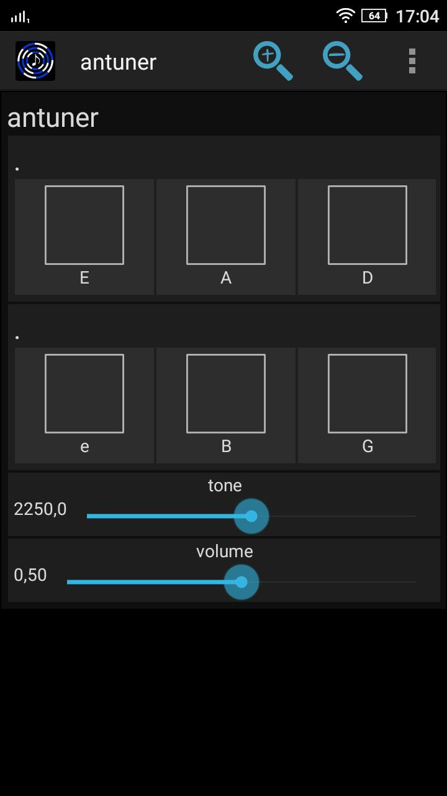

# antuner
a lightweight tuning fork written in Faust

* .dsp is a Faust code (can be compiled to several architectures)
* .apk in a compiled app for Android (download it and install manually)

the [Faust](https://faust.grame.fr/) website provides a nice [live tool](https://faustide.grame.fr/) to run and compile code

standard EADGBe tuning is considered in the code. if you want another tuning change the frequencies (and note names) according to the pitch table [found here](https://en.wikipedia.org/wiki/Pitch_(music)).
